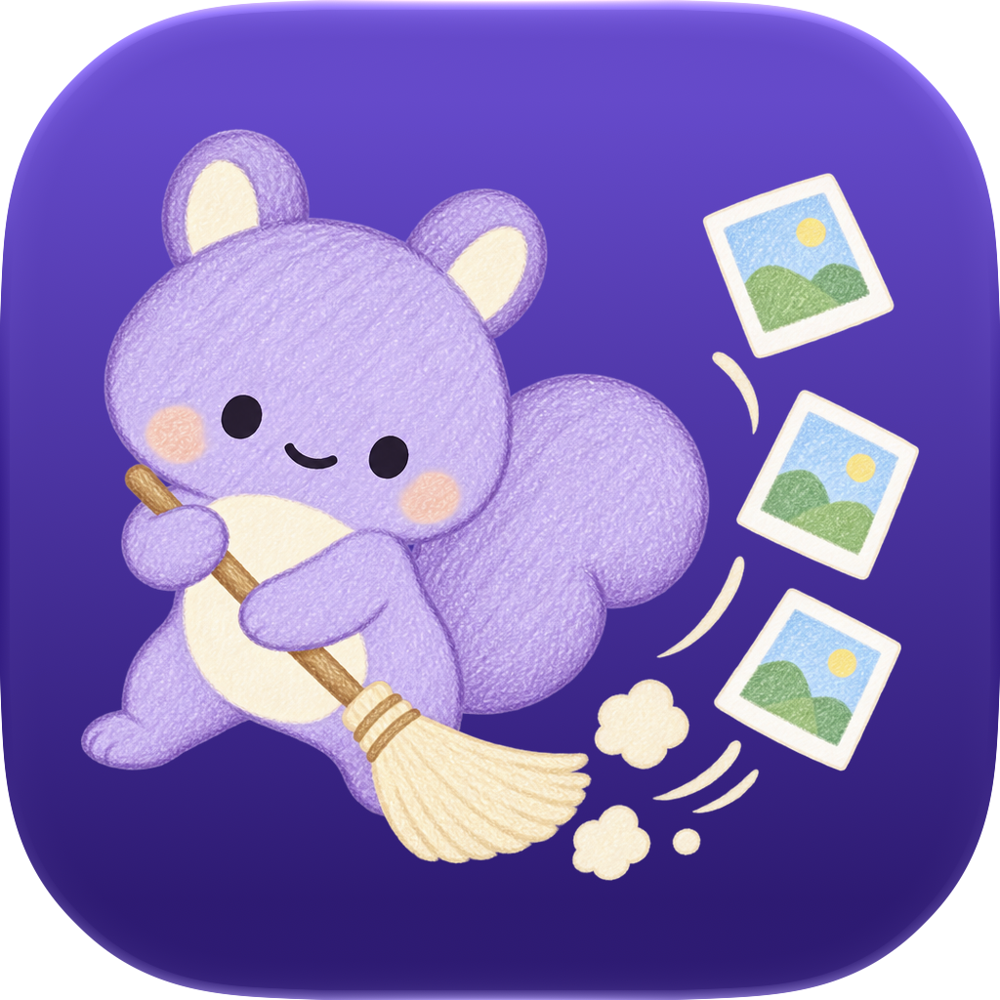

<p align="center">
  
</p>

<h1 align="center">쓱싹 소개 사이트</h1>

<p align="center">
  <b>쓱</b> 넘기고 <b>싹</b> 비우는, 함부로 지우지 않는 iOS 사진 정리 앱의 랜딩 페이지<br>
  <a href="https://jsonpassion.github.io/ssukssak-site/"><b>jsonpassion.github.io/ssukssak-site</b></a>
</p>

---

## 무엇인가요

**쓱싹**은 겹친 사진, 초고화질, 큰 파일을 찾아 한 번에 걷어내는 iOS 사진 정리 앱입니다.
이 저장소는 그 소개 사이트로, **개인정보 처리방침**과 **이용약관**도 함께 호스팅합니다(App Store 심사 요구사항).

- 빌드 도구와 프레임워크 없음. **정적 HTML 한 장**(CSS, JS 인라인)
- `main`에 푸시하면 **GitHub Pages**가 자동 배포
- 외부 의존성은 로티 재생용 [lottie-web](https://github.com/airbnb/lottie-web) CDN 하나뿐

## 구조

```
.
├── index.html          # 랜딩 (CSS, JS 전부 인라인, 단일 파일)
├── privacy/index.html  # 개인정보 처리방침, Data Not Collected 근거
├── terms/index.html    # 이용약관, Apple 표준 EULA 기준
├── icon.png            # 앱 아이콘 렌더 (파비콘, 로고, OG 이미지 공용). 앱 리포 `Tools/icon/make.py` 산출물(도리가 빗자루로 사진을 쓸어 날리는 그림, 2026-09-23)
└── assets/
    ├── img/            # 히어로 폰 목업용 홈 스크린샷 ko/en
    ├── lottie/         # 수제 로티 10종
    └── video/          # 시네마틱 루프 5종 + 포스터
```

## 디자인 (브랜드 3.0, 2026-09-17)

앱과 같은 **"종이와 라벤더"** 테마입니다. 바탕은 옅은 라벤더 종이, 글은 자줏빛 먹, 강조는 브랜드 바이올렛 하나.
색으로 기능을 구분하지 않고, 배지와 캡슐 대신 헤어라인과 여백으로 나눕니다. 어두운 구간은 시네마틱 밴드 하나뿐입니다.
전체 계획은 앱 리포의 `Resources/RebrandPlan.md`.

### 캐릭터 도리

사진을 쌓아 두는 버릇이 있는 라벤더 다람쥐. 커다란 꼬리가 빗자루라서 사진첩을 쓸어 줍니다.
사이트에서는 앱 리포의 `Tools/character/render_faces.py`가 그린 PNG를 씁니다
(`assets/img/dori-plain-idle.png`, `dori-plain-happy.png`, `dori-sweep-happy.png`).
숨쉬기는 CSS 애니메이션, `happy`는 등장할 때 한 번 폴짝. `prefers-reduced-motion`이면 정지.
등장 위치는 앱과 같은 규칙으로 **쉬어 가는 자리에만**: 히어로(기본), 데모 완료(기쁨), 마무리 CTA(빗자루질), 첫 방문 안내.

### 토큰

| 토큰 | 값 | 용도 |
|---|---|---|
| `--paper` / `--card` | `#F8F6FC` / `#FFFFFF` | 바탕 / 카드 |
| `--ink` / `--ink2` / `--line` | `#211B32` / 62% / 10% | 본문 / 보조 / 헤어라인 |
| `--brand` | `#6744D0` | 버튼, 강조 글자, 가격 하이라이트 |
| `--lilac` / `--lilac-soft` | `#A990E4` / 10% | 밴드 하이라이트, 추천 요금제 바탕 |
| `--coral` | `#E24A58` | 쓰레받기 버튼(되돌릴 수 없는 동작) |
| `--night` | `#16102A` | 시네마틱 밴드 배경 |

### 섹션

히어로(도리 + 홈 스크린샷 폰 목업) → 쓰는 법(4단계) → 기능(4종) → 미리 해보기 → 안심 설계 → **시네마틱 밴드** → 가격 → 마무리 CTA(도리) → 푸터

### 인터랙션

- **언어 전환** EN / 한국어. 한국어 마크업이 원본이고 영어 사전은 각 요소의 innerHTML을 키로 씁니다. 폰 스크린샷도 함께 바뀝니다.
- **스크롤 리빌** `IntersectionObserver`, 회전 없이 조용히(`.reveal`, `--i`로 스태거)
- **시네마틱 배경 영상** 화면 밖이면 일시정지, `prefers-reduced-motion`이면 포스터만
- **미리 해보기** 카드를 좌/우로 넘겨 담긴 용량이 집계되는 인터랙티브 데모, 끝나면 도리가 폴짝
- **첫 방문 안내** 최초 1회만(`localStorage: ssukssak_coach_v2`), 탭하면 쓱 걷힘

## 에셋

### 로티 10종 (`assets/lottie/`)

전부 수제 JSON입니다. 모션 문법: **돋보기 = 찾는 중**, **빗자루질 = 실제 삭제**, **도리 = 완료**.

`magnify_scan`, `dust_poof`, `dustpan_fill`, `broom_sweep` (쓰는 법 4단계)
`swipe_cards`, `stack_merge`, `vacuum_shrink`, `gauge_free` (기능 4종)
`shield_check` (안심 설계), `arrow_bounce` (첫 방문 안내)

### 시네마틱 영상 (`assets/video/`)

| 파일 | 쓰임 |
|---|---|
| `moment.mp4` | 미리 해보기 옆, 저장 공간 부족의 순간 |
| `feat_dupes.mp4`, `feat_diet.mp4`, `feat_heavy.mp4` | 나머지 세 기능 필름 |
| `sweep.mp4` | 시네마틱 밴드 배경 |

재인코딩 기준:

```bash
ffmpeg -i in.mp4 -an -c:v libx264 -crf 30 -preset slow \
  -movflags +faststart -pix_fmt yuv420p -vf scale=1280:720 out.mp4
ffmpeg -i out.mp4 -vframes 1 -q:v 3 poster.jpg
```

## 로컬에서 보기

`file://`로 열면 영상과 로티가 로드되지 않으니 정적 서버로 띄우세요.

```bash
python3 -m http.server 8000
```

첫 방문 안내를 다시 보려면 콘솔에서:

```js
localStorage.removeItem('ssukssak_coach_v2'); location.reload();
```

## 배포

`main` 브랜치에 푸시하면 GitHub Pages가 루트를 그대로 서빙합니다. 별도 빌드, 액션 없음.

## 법적 페이지

`privacy/`와 `terms/`는 App Store 심사 제출용이며 앱 내 페이월과 설정 화면에서 직접 링크합니다.
**문구를 바꿀 때는 App Store Connect의 URL과 앱 내 링크가 여전히 유효한지 확인하세요.**

## 푸터 규격

모든 ForgeLab 앱 사이트 공통으로 5요소를 유지합니다:
개인정보 처리방침, 이용약관, ✉️ 문의하기 버튼, © 2026 ForgeLab, ForgeLab 대표 Jason Lee.

> 문의 이메일은 **버튼 뒤 `mailto:`로만** 두고 본문에 텍스트로 노출하지 않습니다.

---

© 2026 ForgeLab, 대표 Jason Lee. 사이트 코드와 에셋의 무단 사용을 금합니다.
